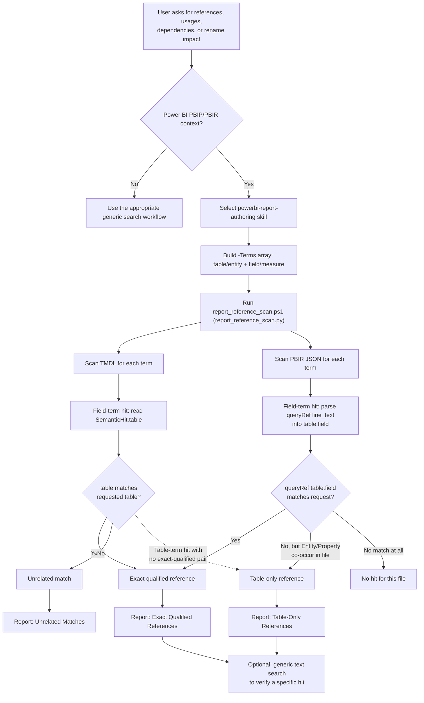

## Context

See [proposal.md](proposal.md) for motivation and [specs/powerbi/pbip-reference-search/spec.md](specs/powerbi/pbip-reference-search/spec.md) for the behavior contract. The existing scanner lives at `plugins/powerbi/skills/powerbi-report-authoring/scripts/report_reference_scan.py`, invoked through `report_reference_scan.ps1`. It already:

- Scans TMDL files per term and records, for each hit, the enclosing `table`, `object_type` (`record`/`measure`/`calc_column`/`column`), and `object_name` — so a field-term hit's containing table is already known at the point the hit is produced.
- Scans PBIR JSON files per term against three independent regexes (`Entity`, `Property`, `queryRef`) and records `match_type`, `page`, `visual`, `file`, `line`, and `line_text` — but does not parse the `queryRef` value into its table/field components, and has no notion of pairing an `Entity` hit with a `Property` hit in the same visual.
- Runs each requested term as a fully separate pass (`scan_semantic_models`/`scan_reports` take one `term` at a time); the caller currently just concatenates or displays hits per term, so a two-term request (table + field) produces two independent hit lists with no cross-referencing step.

The `template-report-kb.md` reference confirms `queryRef` is rendered as a single string of the form `"<table>.<field>"` (or `"<table>.<hierarchy>.<level>"` for hierarchy fields), one key/value pair per line in the pretty-printed PBIR JSON. That makes `queryRef`'s `line_text` a self-contained, already-captured signal for table/field pairing — no scanner code change is required to obtain it, only a post-processing step that parses the existing `line_text` for `queryRef` hits.

## Goals / Non-Goals

**Goals:**
- Make the reference-search intent reliably route to the existing scanner via `powerbi-report-authoring`'s discovery metadata and an explicit routing section, without introducing a second skill or duplicating scanner logic.
- Define a correlation step that a human or the model can apply, deterministically, to the scanner's *existing* output fields (`table`, `object_name`, `match_type`, `line_text`, `file`, `visual_internal`) to classify hits as exact-qualified, table-only, or unrelated.
- Keep the fix scoped to discovery metadata, routing instructions, result-interpretation guidance, and (only if needed) minimal scanner output additions — not a rewrite of the scanning engine.

**Non-Goals:**
- Building a full cross-model dependency graph (that is the separate, not-yet-applied `add-python-powerbi-dependency-checking` change).
- Guaranteeing correlation for every conceivable PBIR shape; some visuals may reference a table and field through forms this design does not parse (e.g., dynamic bindings). Those cases fall back to table-only classification rather than a false exact match.
- Changing TMDL semantic-hit categorization logic beyond using the `table` field that already exists on each hit.

## Decisions

**Do the correlation as a post-processing/interpretation step, not inside the scanner's per-term scan functions.**
`scan_semantic_models` and `scan_reports` operate one term at a time and return flat hit lists; forcing them to become term-pair-aware would complicate their signature and reduce reusability for single-term scans (which remain valid, e.g. "find everything named `Region` anywhere"). Instead, when a request names both a table and a field, run the existing single-term scan for each term and correlate the two hit lists afterward, keyed by `file` (and `table` for TMDL, parsed `queryRef` for PBIR). Alternative considered: modify the scanner to accept `--table-term`/`--field-term` and emit pre-correlated output. Rejected for this change because it's a larger, riskier surface change to a script with an embedded reviewed-source SHA-256 comment; the correlation logic can live in the skill's documented workflow guidance instead, and only be pushed into the script later if the manual step proves error-prone.

**Use `queryRef` as the authoritative exact-qualified signal for PBIR hits; treat unpaired `Entity`+`Property` co-occurrence as table-only.**
`queryRef`'s `"<table>.<field>"` string is unambiguous and already captured verbatim in `line_text`. `Entity` and `Property` hits are separate JSON keys on different lines within the same query-projection object, so pairing them from line-based hits alone risks false positives when a visual binds fields from multiple tables. Per the spec's downgrade requirement, only a matching `queryRef` promotes a hit to exact-qualified; `Entity`+`Property` co-occurrence without a corresponding `queryRef` stays table-only. Alternative considered: parse the surrounding JSON structurally (walk up from each `Entity`/`Property` line to its enclosing object) to pair them directly. Deferred — it would require the scanner to parse full JSON trees per hit rather than line-based regex scanning, a larger change than this proposal's scope; `queryRef` coverage is expected to handle the common cases (most visual fields and measures project a `queryRef`).

**For TMDL, classification is a direct filter on the existing `table` field, no new parsing needed.**
A field-term hit's `SemanticHit.table` already names its containing table when the scanner walks TMDL top-to-bottom tracking `current_table`. Exact-qualified = field-term hits where `hit.table` case-insensitively equals the requested table name; unrelated = field-term hits where it does not; table-only = table-term hits in a file with no matching exact-qualified hit.

**Keep the routing and correlation guidance in `powerbi-report-authoring/SKILL.md`, not a new skill.**
The scanner is already bundled there and the proposal's capability (`powerbi/pbip-reference-search`) describes a *routing and interpretation contract*, not a new tool. Splitting it into a separate skill would duplicate the "when to use which reference tool" decision the skill already has to make for rename-impact scans.

## Workflow

The diagram shows the two routing decisions the spec requires — selecting the scanner before generic search, and never collapsing table-only or unrelated hits into the exact-qualified bucket — and the two independent correlation paths (TMDL `table` field vs. PBIR `queryRef` parsing) described in the Decisions above. It depicts the two-term case; a single-term request (table-only or field-only) skips the classification branches entirely and reports every hit for that one term directly, per the Single-Term Reference Search Remains Supported requirement.

## Risks / Trade-offs

- **[Risk]** `queryRef` does not cover every PBIR construct (e.g., some filter or slicer bindings may use different keys). → **Mitigation**: the spec requires unpaired Entity/Property matches to be downgraded to table-only rather than guessed as exact, so the failure mode is under-confidence (labeled as needing manual check), not a false positive.
- **[Risk]** Relying on documentation-level (SKILL.md) correlation guidance instead of enforcing it in code means a future edit could regress the classification behavior silently. → **Mitigation**: the spec's scenarios are concrete enough to serve as manual/regression validation prompts (see tasks.md); if drift recurs, promote the correlation step into the Python scanner in a later change.
- **[Risk]** Expanding the skill description with more trigger phrases could cause the skill to over-trigger on unrelated generic-search requests. → **Mitigation**: the added phrases are specific to Power BI PBIP artifacts (tables, columns, measures, reports) and the routing section still requires a genuine Power BI PBIP context before selecting the scanner.

## Migration Plan

This is a documentation and workflow-guidance change to an existing skill; no data migration applies. Deploy by editing `powerbi-report-authoring/SKILL.md` (description, routing section, result-interpretation section) and bump its `metadata.version`. Rollback is reverting the SKILL.md edit; the scanner script and its behavior are unaffected unless a future change chooses to push correlation logic into the Python implementation.
