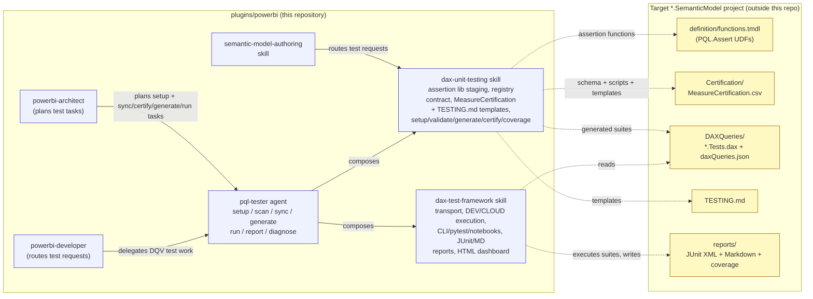
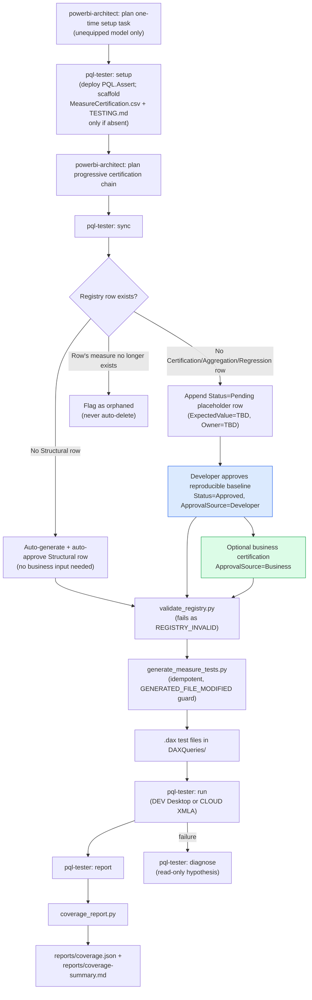

## Context

See [proposal.md](proposal.md) for motivation. This is a cross-cutting change: it adds two skills (`dax-unit-testing` and `dax-test-framework`), a new agent (`pql-tester`), and modifies existing routing and planning behavior. The design is grounded in an external reference implementation of `dax_test_helpers.py`, a standalone runner, a pytest wrapper, DEV/CLOUD notebooks, a certification generator, and a testing guide. Those files are behavioral references, not plugin assets to copy verbatim. The target-project registry lives outside this repository, while the plugin repository supplies reusable contracts, scripts, prompts, templates, an HTML viewer, and sanitized sample artifacts.

The reference implementation has an 11-column certification CSV and a generator that validates live DAX before atomically replacing the generated suite and query-tab registration. The generalized skill adds approval-audit fields and progressive certification; it therefore needs a deliberate legacy migration boundary rather than silently interpreting existing approvals.

## Architecture Diagram

*Solid arrows are plan/delegate/compose relationships between agents and skills inside this repository; dashed arrows are the artifacts each skill reads or writes in a target semantic model project once adopted.*

## Workflow Diagram

*The developer baseline (blue) makes a measure executable immediately. Business certification (green) is optional and additive; it never blocks baseline generation or execution. `Structural` rows remain fully automated.*

## Goals / Non-Goals

**Goals:**
- Provide a deterministic, script-backed registry contract (validate/generate/certify/coverage) that both agents and any downstream CI gate can consume identically.
- Let developers establish immediately executable, reproducible baseline tests while preserving a separately auditable, business-owned certification layer and letting agents own `Structural` coverage end-to-end.
- Make measure test planning a first-class, visible step in spec authoring (`powerbi-architect`) rather than an implicit afterthought left to `powerbi-developer`.
- Give any downstream automation a fixed, machine-readable error-type vocabulary instead of free-form failure text.

**Non-Goals:**
- Executing tests against live customer models as part of this change.
- Implementing GATE-001's own CI/PR publication or blocking-merge plumbing — that is a downstream consumer's responsibility.
- Replacing or modifying `dax-data-quality` (Power Query row-level checks stay a separate concern from DAX Query View unit assertions).
- Retrofitting the new task-planning requirement into specs already drafted or approved before this change lands.

## Decisions

**Progressive certification model (Structural, Developer, then Business) instead of a blocking business-approval flow.**
Requiring a business checkpoint before a measure can generate and execute tests prevents developers from establishing initial coverage over an existing model. `Structural` rows stay fully automated; a developer may explicitly approve a measured, reproducible baseline as `ApprovalSource=Developer`; business certification is added later as `ApprovalSource=Business`. The independent `ApprovalSource`, `ApprovedBy`, and `ApprovedOn` fields preserve the audit trail, while `Status=Approved` describes only generation/execution eligibility. Alternative considered: retain a business checkpoint but make it optional per measure — rejected because it leaves an ambiguous audit record for executable non-business tests.

**Deterministic scripts over agent reasoning for anything that runs in CI (`validate_registry.py`, `generate_measure_tests.py`, `certify_measures.py`, `coverage_report.py`, `setup_project.py`).**
GATE-001 explicitly favors scripts for CI-facing operations so results are reproducible and reviewable outside an agent session. Idempotent generation with a content-hash guard (`GENERATED_FILE_MODIFIED`) prevents silent loss of hand-edits. Generation also owns `daxQueries.json` registration deterministically, so a generated suite is discoverable in DAX Query View without a separate manual step and repeat runs leave the file byte-identical. `setup_project.py` is kept separate from `certify_measures.py` because it is the only script permitted to write the model's assertion-library definition file; folding it into `certify_measures.py` would widen that script's write scope from "registry only" to "registry plus model definition". Alternative considered: have `pql-tester` generate `.dax` files directly via reasoning each time — rejected because it is non-deterministic across runs and harder to verify in CI.

**Registry validation has a model-free `--schema-only` mode.**
The integrity rule "`MeasureName` exists in the model" requires a live model or TMDL parse, which is unavailable in a plain CI lint job and meaningless for the shipped `MeasureCertification.template.csv`. Rather than dropping the rule or exempting the template, validation splits into a full mode and a `--schema-only` mode that applies every other rule and explicitly reports the model-existence rule as not evaluated. Alternative considered: always require a model — rejected because it makes the cheapest, most frequent check the most expensive one and leaves the shipped template unverifiable.

**`Structural` is a shared token across two columns, constrained by a cross-field rule.**
`Structural` is both a `TestCategory` and an `ApprovalSource`. To prevent a `Certification` row from claiming automated approval provenance, the schema requires `ApprovalSource=Structural` if and only if `TestCategory=Structural`, and `Structural` approvals carry the literal `N/A` sentinel in `ApprovedBy`/`ApprovedOn` rather than an empty cell or an agent identity. Alternative considered: rename the approval source to `Automated` — rejected because it decouples the audit value from the category it certifies and complicates legacy migration, which maps structural rows on category alone.

**Fixed error-type vocabulary instead of free-form messages.**
A closed set (`VALUE_MISMATCH`, `BLANK_RESULT`, `DAX_ERROR`, `MEASURE_NOT_FOUND`, `CERTIFICATION_PENDING`, `METADATA_INCOMPLETE`, `REGISTRY_INVALID`, `GENERATED_FILE_MODIFIED`, `CONNECTION_ERROR`) lets any downstream CI gate branch on error type without parsing prose. The vocabulary is defined once in the `powerbi/dax-unit-testing` capability and explicitly consumed by `powerbi/dax-test-framework`, so registry-side and execution-side failures share one namespace rather than drifting into two. Alternative considered: structured JSON with a free-text `category` field — rejected because it re-introduces drift between producers and consumers over time.

**Coverage statistics (`coverage_report.py`) as a separate, strictly read-only script rather than a `certify_measures.py scan` extension.**
Coverage stats answer "how much of the model has any registry row, at what status" — a different question from `scan`'s per-measure metadata compliance report. Keeping it a separate script preserves `scan`'s narrower contract and lets coverage stats be run standalone (e.g., for a dashboard or badge) without invoking full model metadata scanning. Alternative considered: fold coverage math into `scan`'s output — rejected because it conflates two distinct read-only reports and would force every `scan` consumer to also parse coverage fields.

**`powerbi-architect` plans the progressive task chain; `powerbi-developer`/`pql-tester` execute it.**
Without an explicit planning-side change, nothing forces a test task to exist per measure — `pql-tester` would only run if someone thought to invoke it. The architect's template now plans `sync` → developer certification → `generate`+`run`, with business certification as an optional follow-on task, so coverage can start immediately. Alternative considered: rely on a build-time linter that fails specs missing test tasks — rejected as heavier tooling for a problem the architect's own template can solve directly.

**Business certification remains additive even when its value is known during planning.**
When a business value is known during requirements gathering, the plan records a business-certification task alongside the executable developer baseline rather than replacing it. This allows subsequent developer checks to be added without reopening business approval, while retaining an explicit record of the business-provided test.

**Two skills rather than one overloaded skill.**
The execution framework and registry lifecycle have different inputs, failure modes, and reuse boundaries. `dax-test-framework` owns transport, discovery, execution, filtering, reports, and the HTML viewer; `dax-unit-testing` owns assertion-library staging, registry integrity, generation, certification, and coverage. The `pql-tester` agent composes them explicitly. Alternative considered: place all scripts and notebooks under one skill — rejected because consumers that only need execution would inherit business-certification rules and because the runner can be reused with non-registry DAX suites.

**Onboarding templates delivered by a dedicated `setup` mode, not authored ad hoc per project.**
A user adopting this capability on an existing model needs two concrete starting artifacts, not just schema documentation: a `MeasureCertification.csv` they can immediately open and fill in, and a `TESTING.md` that explains the workflow in their own project. `dax-unit-testing` ships both as templates (`MeasureCertification.template.csv`, `TESTING.template.md`), and `pql-tester` gains a `setup` mode — invoked once by the `powerbi-architect`-planned setup task and backed by the deterministic `setup_project.py` script — that deploys the PQL.Assert library and copies both templates into the target project only if the destination files do not already exist. This keeps the behavior identical for a user working with the Copilot CLI or with Claude Code: both `AGENTS.md` and `CLAUDE.md` document the same `setup` step and the same resulting `TESTING.md`/registry files, so onboarding does not diverge by agent surface. Alternative considered: only document the schema in `references/certification-registry-schema.md` and let the user hand-author their own CSV and `TESTING.md` — rejected because it re-creates avoidable boilerplate per project and produces inconsistent onboarding docs across models.

**DAX-native tests plus Python transport, not Python-generated assertions.**
The reference pattern keeps assertions in `.dax` Query View files and uses Python only to send the unchanged query text, parse typed result rows, and publish reports. This preserves Desktop parity and avoids a second assertion language. Alternative considered: translate DAX assertions into Python checks — rejected because it would diverge from the model's PQL.Assert behavior.

**Explicit legacy registry migration.**
The reference 11-column CSV cannot be safely promoted to the 14-column audit contract by positional defaults. A migration command or documented import path must require an explicit mapping for approved rows and may only auto-fill fields whose meaning is unambiguous (`ApprovalSource=Structural` for structural rows). Ambiguous approvals remain blocked and visible. Alternative considered: infer all legacy `Approved` rows as business-approved — rejected because it would fabricate audit provenance.

**Runtime XML loading instead of embedded report data.**
The HTML dashboard is a static, shareable asset. It fetches a configurable JUnit XML artifact with a cache-busting query parameter, parses both a single `testsuite` and a `testsuites` wrapper, and falls back to a local file picker when browser file access or HTTP serving prevents automatic loading. This keeps generated results in the test framework's XML artifacts and lets the same dashboard render new runs without regeneration. Alternative considered: embed JSON results into the HTML — rejected because it produces stale, repository-specific copies and prevents artifact substitution.

**Sanitized report fixtures.**
The repository includes representative CLI JUnit XML, pytest JUnit XML, and Markdown failure-summary samples with generic suite/test names. They are used to validate parsing and to make the skill's output contract reviewable without requiring a live semantic model. Alternative considered: commit a real project's reports — rejected because that would leak model names, business values, and machine-specific metadata.

**Skill-creator evaluation after implementation, with deterministic assertions and human review.**
The skills are workflow-heavy and can under-trigger or silently broaden scope, so evaluation is part of completion rather than optional polish. Three prompts will compare no-skill/baseline behavior to each skill, grade objective assertions, aggregate timing/token/pass-rate data, and render the results with `generate_review.py`; human feedback then drives one revision cycle before description optimization is considered.

## Risks / Trade-offs

- **[Risk]** A registry contract with five cooperating scripts spread across `setup`/`validate`/`generate`/`certify`/`coverage` increases the surface a consuming project must wire up correctly. → **Mitigation**: each script has a single, narrow read/write contract (documented in `certification-registry-schema.md`) and the error-type vocabulary is shared across all of them, so partial adoption (e.g., validate + generate only) still works without coverage or sync.
- **[Risk]** Developer-certified baselines can diverge from the business definition. → **Mitigation**: `ApprovalSource`, `ApprovedBy`, and `ApprovedOn` make that distinction machine-readable; coverage reports separately show developer and business coverage rather than collapsing them into one percentage.
- **[Risk]** `pql-tester`'s guardrail against fabricating baselines or business values depends on prompt-level discipline, not a hard technical control — a model could still hallucinate a value if instructions are ambiguous. → **Mitigation**: the agent writes a non-Structural approved row only after an explicit developer or business approval in the same request; `validate_registry.py` independently rejects any approved row still carrying a `TBD` placeholder.
- **[Risk]** Coverage statistics can create a false sense of completeness. → **Mitigation**: the skill documentation states coverage is a registry snapshot, not proof tests pass, and reports separately distinguish `Pending`, executable developer-certified, and business-certified rows.
- **[Risk]** The generalized registry schema may be mistaken for a drop-in replacement for an existing 11-column CSV. → **Mitigation**: add a migration task and fixture tests that reject ambiguous approval provenance instead of guessing.
- **[Risk]** Static HTML viewers opened directly from disk may be blocked from fetching adjacent XML by browser file-origin rules. → **Mitigation**: document serving the report folder over a local HTTP server and retain the manual XML file-picker fallback.
- **[Risk]** Python transport dependencies are Windows- and ADOMD.NET-sensitive. → **Mitigation**: retain `uv`-only invocation, dynamic Desktop-port discovery, environment-only CLOUD credentials, profile-specific diagnostics, and a smoke gate before suite execution.

## Migration Plan

This is an additive documentation/tooling change with no runtime system to migrate in this repository. Rollout is: (1) stage the two skills, reusable scripts/templates, HTML viewer, and agent, (2) wire routing updates into `powerbi-developer`, `semantic-model-authoring`, and `powerbi-architect`, (3) update root registries (`AGENTS.md`, `CLAUDE.md`) so both the Copilot CLI and Claude Code document the same `pql-tester setup` step, (4) validate against fixture models, generic legacy registries, and sanitized report artifacts, and (5) run the skill-creator evaluation loop. A target semantic model adopts the capability by running `pql-tester setup` once — deploying its selected PQL.Assert subset and scaffolding `Certification/MeasureCertification.csv` and `TESTING.md` from the skill's templates only where absent — then configuring its model path/profile and explicitly migrating any legacy registry. Rollback is a revert of the added files and routing edits; target model artifacts remain untouched unless a consuming project opts in.

## Open Questions

None that change the scope or contract. The exact three evaluation prompts may be refined after the first skill draft, but their coverage areas and objective assertions are fixed in the task list.
