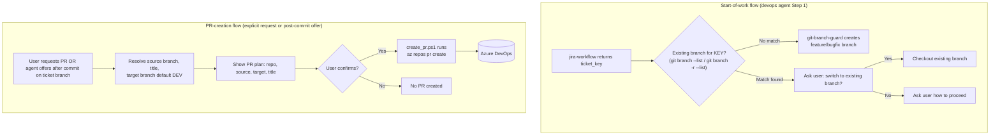

## Context

`git-branch-guard` currently only validates the *current* branch's name (protected-branch check, `feature/`/`bugfix/` prefix, ticket-key regex) via `check_git_branch_guard.ps1`, run *after* a branch already exists — see proposal.md for the full motivation. There is no pre-creation lookup, and no PR-creation capability at all today; PRs are opened manually in the Azure DevOps web UI. The Azure DevOps CLI (`az` + `azure-devops` extension) is already installed and reachable via the bundled path documented in `plugins/devops/skills/git-branch-guard/assets/azure-devops-cli-setup.md`, and `az devops configure --defaults organization=... project=...` has already been run once for this machine/user.

## Architecture Diagram

## Goals / Non-Goals

**Goals:**
- Add a branch-existence lookup that runs *before* branch creation in the `devops` agent's start-ticket flow (orchestration change, not a new skill).
- Add a new PR-creation script/asset inside `git-branch-guard` that wraps `az repos pr create`, gated on an explicit confirmation step, following the same "show plan, ask yes/no" pattern already used by `azure-devops-standard-branch-policy`.
- Keep both features additive to the existing `git-branch-guard` skill and `devops` agent — no change to `jira-workflow`'s Jira-side behavior.

**Non-Goals:**
- Not building a general-purpose Azure DevOps PR management skill (list PRs, review, merge, etc.) — only creation.
- Not changing branch *validation* rules (protected list, prefix, ticket-key regex) — only adding a pre-creation existence check.
- Not automating PR creation without confirmation under any circumstance, including CI/non-interactive contexts.

## Decisions

### 1. Branch-existence check lives in the `devops` agent orchestration, not inside `check_git_branch_guard.ps1`
`check_git_branch_guard.ps1` validates the *current* branch after checkout/creation; it has no natural hook to run *before* a branch is created. Instead, the `devops` agent's Step 1 (start-ticket trigger, in `devops.agent.md`) gets a new sub-step between receiving `ticket_key` from `jira-workflow` and invoking `git-branch-guard`: run `git branch --list "*<KEY>*"` and `git branch -r --list "*<KEY>*"` (after a `git fetch` if remotes are stale) to search for an existing match. This keeps `git-branch-guard`'s existing script focused on validation, and keeps the new "search then ask" logic where the rest of the start-ticket sequencing already lives.
- Alternative considered: add the lookup as a new mode/flag on `check_git_branch_guard.ps1`. Rejected — that script's contract (validate current branch, exit 0/1) is reused elsewhere (`## Mandatory rule` says it runs before any implementation work); overloading it with a pre-creation search mode would conflate two different lifecycles (pre-creation vs. already-on-branch).

### 2. PR creation is a new script asset under `git-branch-guard/assets/`, following the `azure-devops-standard-branch-policy` pattern
Add `plugins/devops/skills/git-branch-guard/assets/create_pr.ps1` (PowerShell; plain `.ps1` extension — see the note at the end of this section) that:
1. Accepts `-Repo`, `-SourceBranch`, `-TargetBranch` (defaults to `DEV`), `-Title`, optional `-Org`/`-Project`.
2. Resolves the source branch and Jira key from the current branch if not passed explicitly.
3. Prints the exact plan (repo, source, target, title) and requires the caller (the agent) to have already gotten a yes/no from the user — the script itself does not prompt interactively, mirroring `apply_standard_branch_policies.ps1`'s reliance on the agent for the confirmation gate, since the agent (not the script) owns the conversation with the user.
4. Runs `az repos pr create --repository <Repo> --source-branch <SourceBranch> --target-branch <TargetBranch> --title <Title> [--org ...] [--project ...]`.
- Alternative considered: have the script itself prompt with `Read-Host` for yes/no. Rejected — every other confirmation gate in this plugin (branch policy, Jira comment posting) is owned by the calling agent turn, not the script, so the user sees one consistent confirmation UX (a chat message, not a terminal prompt) across skills.
- Note on extension: this skill's scripts were originally stored as `.txt` ("for portability", no real justification found); that broke standard `-File` invocation ( `-File` rejects non-`.ps1` files on both PowerShell 5.1 and 7) and needed a `ScriptBlock]::Create` workaround. All existing scripts (`check_git_branch_guard`, `apply_standard_branch_policies`, `setup_azure_cli`) were renamed to `.ps1` and their unneeded `#Requires -Version 7.0` lines removed, so `create_pr.ps1` follows suit and uses the standard `powershell -ExecutionPolicy Bypass -File create_pr.ps1 ...` invocation, no workaround needed.

### 3. Trigger detection for the post-commit PR offer reuses the existing post-commit hook in `devops.agent.md` Step 3
`devops.agent.md` Step 3 already runs after every `git commit` the agent performs (for the Jira comment offer). Add a second, independent sub-step there: if the current branch matches the ticket-branch pattern (`feature/`/`bugfix/` + ticket key — the same regex `git-branch-guard`'s validator already uses), ask "Would you like to open a PR for this branch?" before or after the Jira-comment question (order doesn't matter functionally; ask them as two separate confirmations, never combined into one compound question).
- Alternative considered: fire the PR offer only when the user explicitly says "ready to test" (Step 2, finish-ticket trigger). Rejected — the proposal and Jira ticket both frame this as a post-*commit* offer, not a post-finish offer; a user may want a PR opened well before the ticket is "ready to test".

### 4. Default target branch (`DEV`) is computed by the agent, not hardcoded in the script
The agent passes `-TargetBranch DEV` by default when the source is a ticket branch, but lets the user's stated target (if any) override it before invoking the script. The script itself has `DEV` as its own `-TargetBranch` default too (defense in depth if the script is ever invoked directly), but the agent is expected to always pass an explicit value once it has resolved one.

## Risks / Trade-offs

- [Remote branch lookups require a fresh `git fetch`, which can be slow or fail offline] → Mitigation: attempt `git fetch --quiet` before the remote-branch search; if it fails (e.g., offline), fall back to searching only local + last-known remote-tracking refs and tell the user the remote search may be stale.
- [Users may find two confirmation prompts (Jira comment + PR offer) noisy after every commit] → Mitigation: ask them as clearly separate, skippable yes/no questions (per Decision 3); either can be declined independently without blocking the other.
- [`az repos pr create` can fail for reasons unrelated to missing prerequisites, e.g. no changes between branches, existing open PR for the same branch pair] → Mitigation: surface the CLI's raw error/stderr to the user rather than swallowing it, so they can diagnose without needing agent changes.

## Migration Plan

Purely additive: existing `check_git_branch_guard.ps1` behavior is unchanged, and the new branch-existence check and PR-creation offer are new steps inserted into `devops.agent.md`'s orchestration. No rollback beyond reverting the skill/agent doc and script changes is needed.
