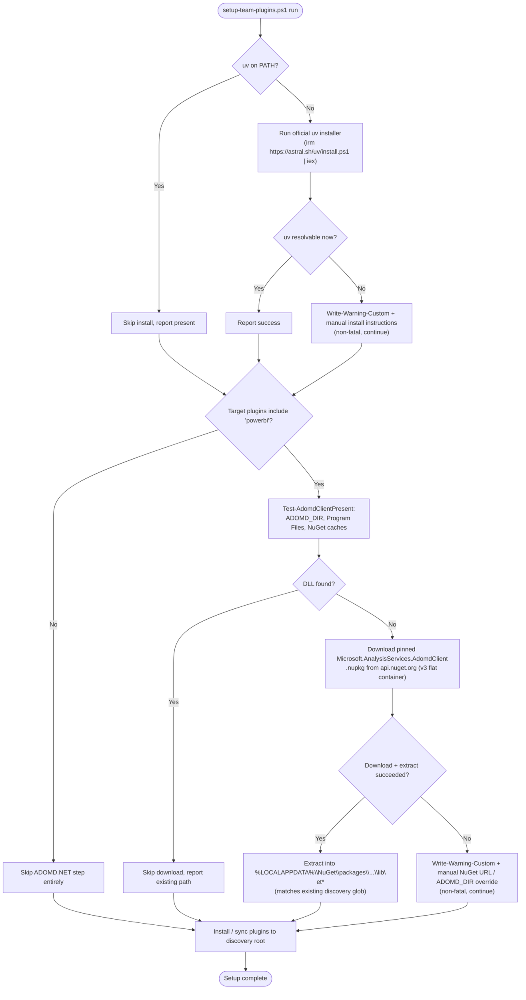

## Context

See [proposal.md](proposal.md) for motivation. Relevant existing state:

- `plugins/powerbi/skills/dax-test-framework/scripts/dax_test_helpers.py`'s
  `_ensure_adomd_on_sys_path()` already searches, in order: an `ADOMD_DIR` env var override,
  `%ProgramFiles%\Microsoft.NET\ADOMD.NET\<version>`, and per-user NuGet package caches at
  `%LOCALAPPDATA%\NuGet\packages\microsoft.analysisservices.adomdclient\*\lib\net*` and
  `%USERPROFILE%\.nuget\packages\microsoft.analysisservices.adomdclient\*\lib\net*`. This search
  logic is not being changed by this proposal.
- `setup-team-plugins.ps1` currently checks for Git, Node.js, and GitHub Copilot CLI/VS Code, but
  has no concept of `uv` or ADOMD.NET at all.
- `dax-test-framework` already has its own `pyproject.toml`/`uv.lock`; `dax-unit-testing` does
  not — its scripts (`setup_project.py`, `generate_measure_tests.py`, `validate_registry.py`,
  `coverage_report.py`, `certify_measures.py`) currently import only the standard library.
- Team members do not have administrator rights on their machines, so any new tool or library
  install must complete without elevation.

## Goals / Non-Goals

**Goals:**
- Make `uv` and (when the `powerbi` plugin is targeted) the ADOMD.NET client library available
  automatically as part of running `setup-team-plugins.ps1`, with no admin rights required.
- Reuse the exact on-disk layout `dax_test_helpers.py` already searches, so no changes to that
  discovery code are needed.
- Keep failures in these new steps non-fatal to the rest of setup (plugins still install even if
  network access is unavailable).
- Give every Power BI skill with Python scripts its own scoped `uv` project, matching the
  pattern `dax-test-framework` already established.

**Non-Goals:**
- Changing `dax_test_helpers.py`'s ADOMD.NET discovery/search logic.
- Supporting non-Windows platforms at all: this change is Windows-only end to end. ADOMD.NET
  itself is Windows-only, and `setup-team-plugins.ps1` already requires Windows PowerShell 5.1+
  (`#Requires -Version 5.1`), so both new steps use the Windows `uv` installer
  (`irm https://astral.sh/uv/install.ps1 | iex`) and Windows-specific paths
  (`%USERPROFILE%`, `%LOCALAPPDATA%`, `%ProgramFiles%`) without any cross-platform branching.
- Vendoring or bundling the ADOMD.NET DLL inside the repository (licensing; it is fetched from
  the official public NuGet feed at setup time instead).
- Building a general-purpose NuGet client; the script only needs to fetch and extract one known
  package id.

## Decisions

### `uv` install: official standalone installer, not `pip install --user uv`
Use the official installer (`irm https://astral.sh/uv/install.ps1 | iex`, run with
`-ExecutionPolicy Bypass` consistent with the rest of the script), which installs the `uv`
binary under `%USERPROFILE%\.local\bin` (no admin) and updates the current user's `PATH`.
Alternative considered: `pip install --user uv` — rejected because it requires an existing
Python + pip on `PATH` first (a chicken-and-egg dependency this script shouldn't assume), whereas
the standalone installer has no prerequisites.

### ADOMD.NET acquisition: NuGet v3 flat-container API, extracted into the same cache layout `dax_test_helpers.py` already searches
Download `Microsoft.AnalysisServices.AdomdClient` directly from the public NuGet v3 flat
container endpoint (`https://api.nuget.org/v3-flatcontainer/...`) with `Invoke-WebRequest` — no
`nuget.exe` or `dotnet` CLI dependency, no credentials (the feed is public/anonymous). Steps:
1. Use a script-level pinned version string (a known-good release, updated deliberately via PR — see risk below) rather than always resolving "latest" from `index.json`.
2. `GET .../microsoft.analysisservices.adomdclient/<version>/microsoft.analysisservices.adomdclient.<version>.nupkg` (a zip file) for that pinned version.
3. Extract it directly into `%LOCALAPPDATA%\NuGet\packages\microsoft.analysisservices.adomdclient\<version>\`, matching the on-disk shape a normal NuGet restore would produce.

This reproduces the exact directory shape `_ensure_adomd_on_sys_path()` already globs
(`.../microsoft.analysisservices.adomdclient/*/lib/net*`), so no changes to that Python search
logic are required and the same override path (`ADOMD_DIR`) still works for anyone who prefers a
manual copy. Alternative considered: install to a repo-local or plugin-local folder — rejected
because `ADOMD_DIR`/NuGet-cache discovery is already user-profile-scoped and shared across all
projects on the machine, avoiding a duplicate download per repo checkout.

### Gate ADOMD.NET provisioning on the `powerbi` plugin being targeted
Only run the ADOMD.NET step when `Get-TargetPlugins` includes `powerbi` (mirrors the existing
`Install-DesktopBridgeCli` gating pattern already in the script). `uv` itself is installed
unconditionally, since it is generic Python tooling with no plugin affinity and is cheap to
check/skip when already present.

### `dax-unit-testing` gets its own `pyproject.toml`/`uv.lock` even with zero third-party deps
Per user decision, add a minimal `pyproject.toml` (project metadata, `requires-python`, no
dependencies) and a generated `uv.lock` so `uv run --project plugins/powerbi/skills/dax-unit-testing
<script>.py` works identically to `dax-test-framework`'s invocation pattern. This keeps the
per-skill isolation convention consistent even though today's scripts need no third-party
packages — if a dependency is added later, it is scoped to this skill from day one.

### Non-fatal failure handling
Both new steps use the same `Write-Warning-Custom` + continue pattern already used elsewhere in
`setup-team-plugins.ps1` (e.g., Node.js absence, `powerbi-desktop-bridge-cli` install failure)
rather than `$ErrorActionPreference = "Stop"` propagating a terminating error, so a network
outage during `uv`/ADOMD.NET provisioning never blocks plugin installation itself.

## Risks / Trade-offs

- **[Risk]** Corporate proxy/firewall blocks `astral.sh` or `api.nuget.org`. → **Mitigation**:
  non-fatal warning with the exact manual commands/URLs to run once network access is available;
  `ADOMD_DIR` remains a documented manual override.
- **[Risk]** NuGet's "latest version" resolution could pick up a future breaking ADOMD.NET
  release. → **Mitigation**: pin a known-good version string in the script (updated deliberately
  via PR) rather than always resolving "latest".
- **[Risk]** Running the setup script repeatedly re-downloads the package if detection doesn't
  correctly recognize a prior install. → **Mitigation**: the detection step reuses the exact same
  glob `dax_test_helpers.py` uses, so once extracted once, subsequent runs see it as already
  present and skip the download.
- **[Risk]** `uv`'s installer script changes its install location or invocation in a future
  release. → **Mitigation**: detection step re-checks `Get-Command uv` after install and reports
  a clear warning (rather than a silent false success) if `uv` still isn't resolvable.

## Open Questions

None — the provisioning location, ADOMD.NET acquisition method, and per-skill `uv` project scope
were all confirmed with the user before this document was written.
