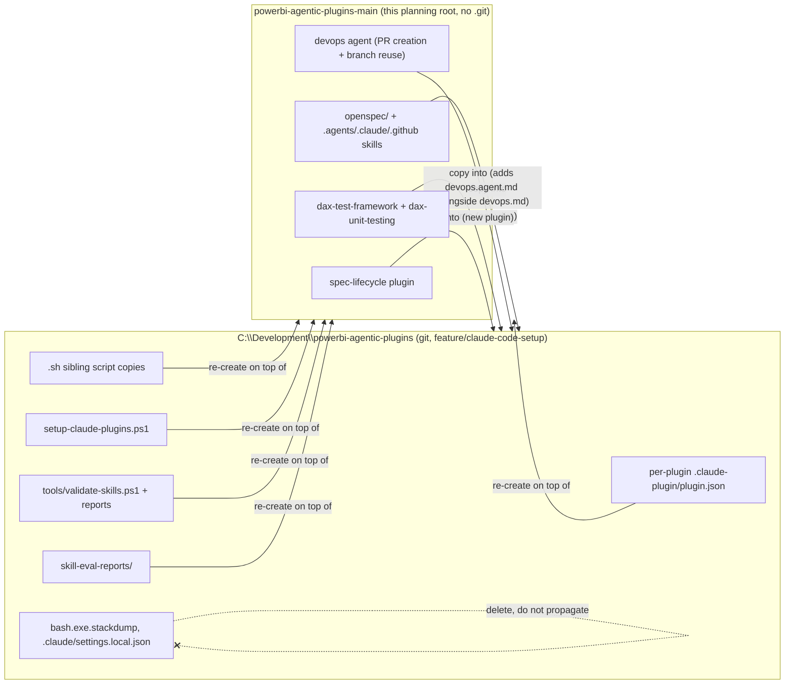

## Context

Two locations hold divergent copies of this project:

- `powerbi-agentic-plugins-main` (this planning root) — a plain file tree, **not** a
  git repository. It has the up-to-date OpenSpec scaffolding, the newer `devops`
  agent (PR creation + branch reuse), and the full `dax-test-framework` /
  `dax-unit-testing` skills.
- `C:\Development\powerbi-agentic-plugins` — a real git clone on branch
  `feature/claude-code-setup`, clean and pushed to `origin`. It independently grew a
  "Claude Code packaging layer": per-plugin `.claude-plugin/plugin.json` manifests,
  `.sh`-sibling copies of PowerShell helper scripts, `setup-claude-plugins.ps1`,
  `tools/validate-skills.ps1` (+ reports), and `skill-eval-reports/`.

Because the two have no shared git history from this side (no `.git` here), there is
no commit-level merge available — reconciliation has to happen at the file-content
level, guided by the diff already performed (see proposal.md - Impact).

## Goals / Non-Goals

**Goals:**
- Bring the git clone's content up to date with everything unique to this file tree.
- Preserve the git clone's Claude Code packaging layer by re-creating it in this file
  tree too, so both locations converge instead of one being a strict subset.
- Document the packaging layer as a spec (`repo-tooling/claude-code-packaging`) so it
  isn't rediscovered by diffing next time.
- Remove clone-local noise (`bash.exe.stackdump`, `.claude/settings.local.json`).

**Non-Goals:**
- Establishing real git history/ancestry between the two locations (e.g. turning this
  file tree into a git repo and rebasing) — out of scope; this change is a one-time
  content reconciliation, not a repo-topology fix.
- Changing the behavior of any existing skill/agent (devops, dax-test-framework,
  dax-unit-testing, etc.) beyond copying it to the other location as-is.
- Deciding a long-term canonical location policy beyond what's needed to stop this
  specific divergence (flagged as an open question below).

## Architecture Diagram

## Decisions

**1. File-level copy instead of git merge.**
Since this file tree has no `.git`, a commit-level merge is impossible from here. The
alternative — initializing git in this tree and attempting a history-based merge — was
rejected because it would fabricate a false shared history and add topology risk for a
one-time reconciliation. Plain, reviewed file copy (guided by the diff already produced)
is simpler and auditable.

**2. Preserve both packaging layers rather than picking one side.**
Overwriting the git clone wholesale would silently delete the Claude Code packaging
work (manifests, installer, validator, eval reports) that only exists there. Overwriting
this file tree wholesale would delete the OpenSpec scaffolding and newer devops/dax
skills that only exist here. Both are kept: the git clone gains this tree's content, and
this tree gains the git clone's packaging layer back.

**3. Document the packaging layer as an OpenSpec capability.**
Without a spec, the packaging conventions (manifest-per-plugin, `.sh` sibling script copies,
installer, validator, eval reports) exist only as tribal knowledge discoverable by
diffing. Capturing them as `repo-tooling/claude-code-packaging` requirements means future
contributors (and future syncs) can validate against a written contract instead of ad hoc
comparison.

**4. Drop clone-local files rather than reconcile them.**
`bash.exe.stackdump` (crash artifact) and `.claude/settings.local.json` (machine-local
permission cache) are not meaningful project content in either direction — they are
deleted, not copied or merged.

## Risks / Trade-offs

- [Risk] Manual/agent-driven file copy across two directory trees may miss a file or
  introduce a stray difference despite the diff already performed. → Mitigation: task
  breakdown re-runs the same file-list diff after copying and treats zero remaining
  unique files (aside from intentionally-dropped noise) as the completion gate.
- [Risk] `devops` agent content exists in two dialects (`devops.md` Claude Code
  frontmatter vs. `devops.agent.md` Copilot frontmatter) with the same behavioral
  content duplicated — a naive one-directional copy could leave them out of sync
  (e.g. the newer PR-creation/branch-reuse behavior landing in only one dialect). →
  Mitigation: both dialects are treated as first-class and kept side by side (per
  the `repo-tooling/claude-code-packaging` "Dual-dialect persona agent files"
  requirement); the git clone's `devops.md` is updated in place with the newer
  content and `devops.agent.md` is added alongside it with equivalent content,
  rather than one file replacing the other. The packaging layer's `.ps1`+`.sh`
  sibling scripts (see below) are regenerated against the updated content, not
  left as stale copies.
- [Risk] This change doesn't resolve *why* two independently-edited copies of the repo
  exist on disk, so divergence could recur. → Tracked as an open question below rather
  than solved here, since it requires a user decision on tooling/workflow, not just file
  content.

## Migration Plan

1. Copy this file tree's unique OpenSpec scaffolding, updated `devops` agent/skill,
   `dax-test-framework`, `dax-unit-testing`, `powerbi-report-authoring` scripts,
   `spec-lifecycle` plugin, and `.claude-plugin/marketplace.json` into the git clone.
2. Update the git clone's `devops.md` in place with the newer PR-creation/branch-reuse
   content, and add `devops.agent.md` (Copilot dialect) alongside it with equivalent
   content — keep both dialects, do not delete either.
3. Re-create the git clone's packaging layer (per-plugin `plugin.json` manifests,
   `.sh` sibling copies of the devops scripts alongside their `.ps1` originals,
   `setup-claude-plugins.ps1`, `tools/validate-skills.ps1` + reports,
   `skill-eval-reports/`) — both back into this
   file tree, and refreshed in the git clone against the newly-copied content.
4. Delete `bash.exe.stackdump` and `.claude/settings.local.json` from the git clone.
5. Re-run the file-tree diff between both locations; the only acceptable remaining
   differences are the intentionally-dropped noise files (now absent from both) — i.e.
   the diff should show no unexplained unique files on either side.
6. Commit the result in the git clone with a clear message describing the
   reconciliation; leave committing/pushing to the user's explicit go-ahead.

**Rollback:** the git clone is a clean, pushed git branch before this change starts;
any local edits can be discarded with `git checkout -- .` / `git reset --hard` up to the
point of the first commit. This file tree is not modified destructively — only added to.

## Open Questions

_Resolved: the user has designated `C:\Development\powerbi-agentic-plugins` (the git
clone) as the ongoing source of truth for future work. This file tree
(`powerbi-agentic-plugins-main`) remains the source for this one-time reconciliation
but should not be independently edited going forward once this change is applied._
